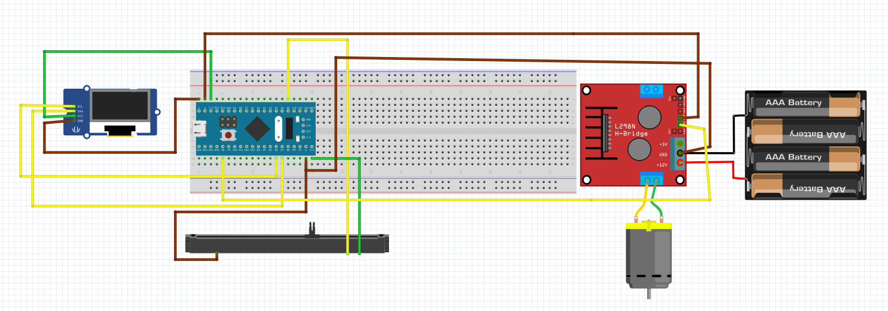

# STM32 Bare Metal: Analog Motor Control & OLED Dashboard

## 📖 Project Overview
This project demonstrates a complete embedded system application using the **STM32F103C8T6 (Blue Pill)** microcontroller. It is developed entirely using **Register Level (Bare Metal)** programming, avoiding the use of HAL or Standard Peripheral libraries to ensure maximum performance and educational value.

The system reads analog values from a slide potentiometer, visualizes the data on an OLED display via a custom I2C driver, and controls the speed of a DC motor using PWM signals via an L298N driver.

## 🎯 Key Features
- **Bare Metal Programming:** No HAL/Arduino libraries used. Direct manipulation of RCC, GPIO, ADC, I2C, and TIM registers.
- **Custom I2C Driver:** Written from scratch to communicate with the SSD1306 OLED controller.
- **Real-Time Analog Data:** 12-bit ADC reading from a slide potentiometer.
- **PWM Motor Control:** Timer-based Pulse Width Modulation for precise speed control.
- **Hardware Isolation:** Integration of L298N driver to separate logic (3.3V) and power (6V) domains.

## 🛠 Hardware Components
| Component | Type | Description |
| :--- | :--- | :--- |
| **MCU** | STM32F103C8T6 | ARM Cortex-M3 Blue Pill |
| **Display** | SSD1306 OLED | 0.96" I2C Display (128x64 or 128x32) |
| **Input** | Slide Potentiometer | 10k Linear Potentiometer |
| **Driver** | L298N Module | Dual H-Bridge Motor Driver |
| **Motor** | DC Hobby Motor | 3V-6V DC Motor with Propeller |
| **Power** | Battery Pack | 4x AAA Batteries (External Power) |

## 🔌 Wiring & Pinout

### 1. OLED Display (I2C1)
| OLED Pin | STM32 Pin | Function |
| :--- | :--- | :--- |
| VCC | 3.3V | Power |
| GND | G | Ground |
| SCL | **PB6** | I2C Clock |
| SDA | **PB7** | I2C Data |

### 2. Slide Potentiometer (ADC1)
| Pot Pin | STM32 Pin | Function |
| :--- | :--- | :--- |
| VCC (Side 1) | 3.3V | Reference Voltage |
| GND (Side 2) | G | Ground |
| Signal (Middle) | **PA0** | Analog Input (ADC Channel 0) |

### 3. Motor Driver (L298N)
| L298N Pin | Connection | Function |
| :--- | :--- | :--- |
| IN1 | **PA8** | PWM Signal (TIM1 CH1) |
| IN2 | **G (GND)** | Direction Control (Low) |
| GND | **G (GND)** | **Common Ground (Crucial)** |
| 12V/VCC | Battery (+) | External Power Source |

---

## ⚠️ Troubleshooting & Challenges

During the development, several critical engineering challenges were solved:

### 1. Clone Chip Issues (CS32/CKS32)
* **Problem:** The ST-LINK failed to recognize the clone STM32 chip (`UNEXPECTED idcode`).
* **Solution:** OpenOCD configuration was modified to bypass ID checks (`CPUTAPID 0`), and the system was flashed using **Connect Under Reset** mode with the BOOT0 jumper set to 1.

### 2. OLED Noise & Artifacts
* **Problem:** Random pixel noise appeared on the screen during startup.
* **Solution:** Implemented a "Horizontal Addressing Mode" clear function to wipe the entire RAM buffer efficiently before displaying data.

### 3. Motor Grounding
* **Problem:** The motor would not spin despite correct logic signals.
* **Solution:** Established a **Common Ground** connection between the external battery pack and the STM32 to complete the signal return path.

---

## 📂 File Structure
* `main.c`: Contains the main loop and all peripheral drivers (I2C, ADC, PWM, OLED).
* `assets/`: Contains project images and diagrams.
* `Register_Blink.hex`: Compiled binary for direct flashing.

---
### Author
Developed to demonstrate proficiency in Low-Level Embedded Systems Engineering.
